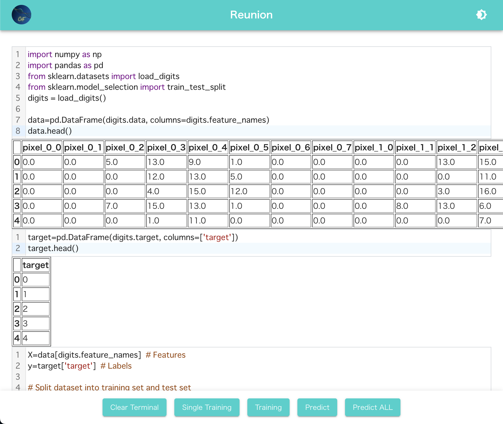

# Internet Computer with Next.js Material-ui and PyScript

## 1. How to use

Clone repository:
```sh
git clone https://github.com/iU-C3F/Reunion.git
cd Reunion
```

## 2. Installation
### 2-1. dfx
Run the following command to install dfx 0.12.1:
```sh
DFX_VERSION=0.13.1 sh -ci "$(curl -fsSL https://sdk.dfinity.org/install.sh)"
```

### 2-2. nodejs
Install [nodejs](https://nodejs.org/ja/download/) suitable for your environment from this site.
(Requires version ^16.15)

Install node modules:
```sh
yarn install # or npm install
```

### 3. Deployment
#### 3-1. Local Deployment Setting
Start up an IC replica:
```sh
# Open a terminal and navigate to your project's root directory, then run the following command to start a local IC replica
dfx start --clean --background
```

#### 3-2. Run Canister Deployment Local
After executing `./deploy_ic.sh`, enter "1" and press Enter.

Automatically run Nextjs web app on localhost:3000 after deploying canisters.

```sh
./deploy_ic.sh
# Choose your deployment environment:
# 1) local
# 2) ic_demo(require Production and Staging Deployment Setting)
# 3) ic_staging(require Production and Staging Deployment Setting)
```

The following output will be displayed, so connect to the frontend URL
```sh
Deployed canisters.
URLs:
  Frontend canister via browser
    frontend: http://127.0.0.1:4943/?canisterId=rrkah-fqaaa-aaaaa-aaaaq-cai
  Backend canister via Candid interface:
    hello: http://127.0.0.1:4943/?canisterId=r7inp-6aaaa-aaaaa-aaabq-cai&id=ryjl3-tyaaa-aaaaa-aaaba-cai
```

Open [http://localhost:3000] in your browser

if stop local IC replica.
```sh
dfx stop
```

### 4.Using PyScript
Python Script can be executed by UI operation like Jupyter Notebook.



After outputting to Terminal in a specific format with the print command, you can execute training and predict with canister by pressing the button at the bottom of the screen.

See `public/scripts/digits.py` for what the sample does

### Reference
[PyScript](https://github.com/pyscript/pyscript)

[PyScript-React](https://github.com/Py4Js/PyScript-React)